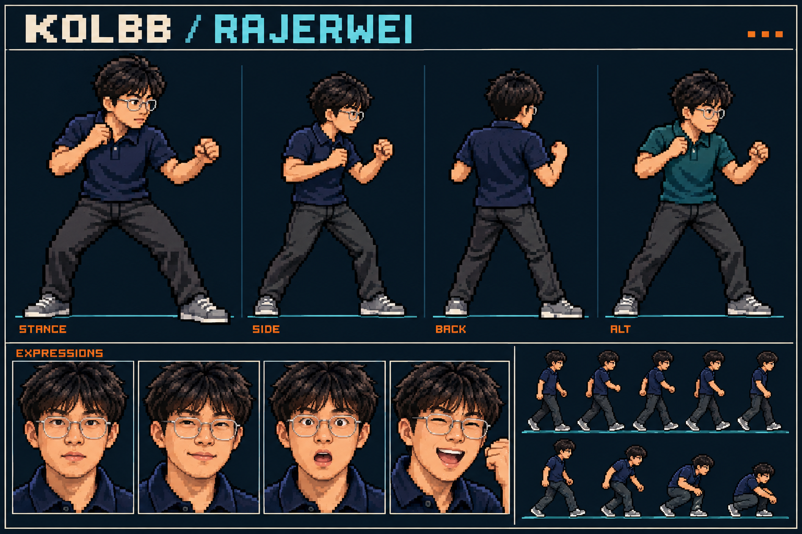
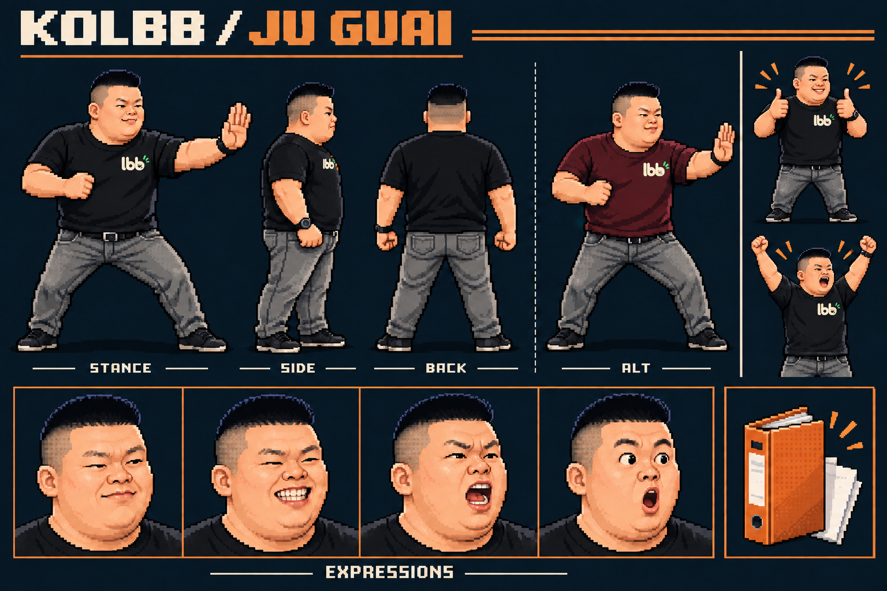
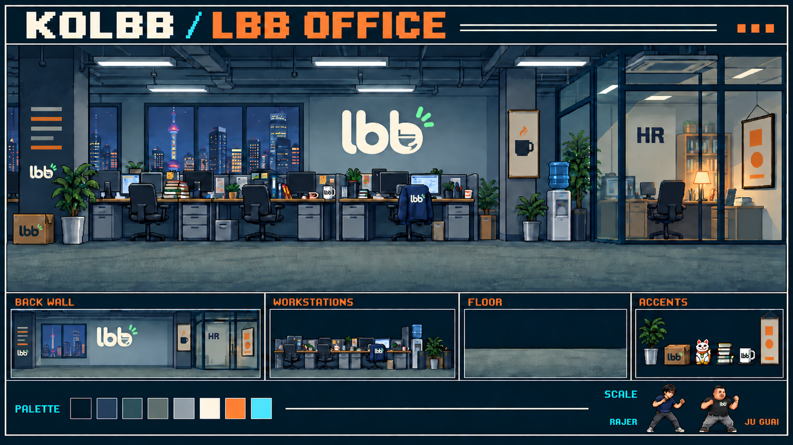
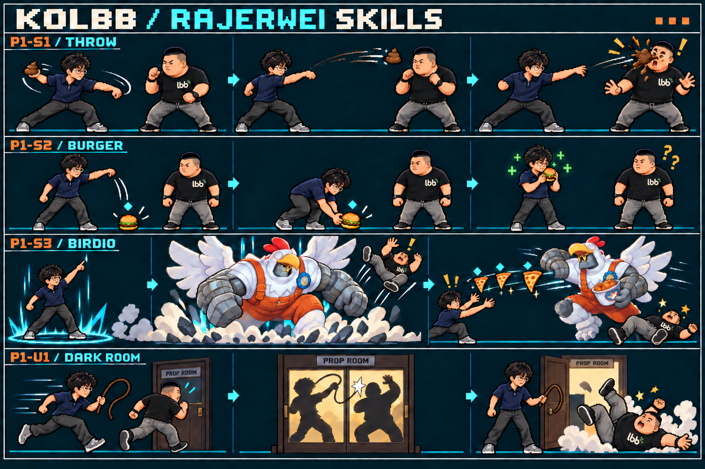
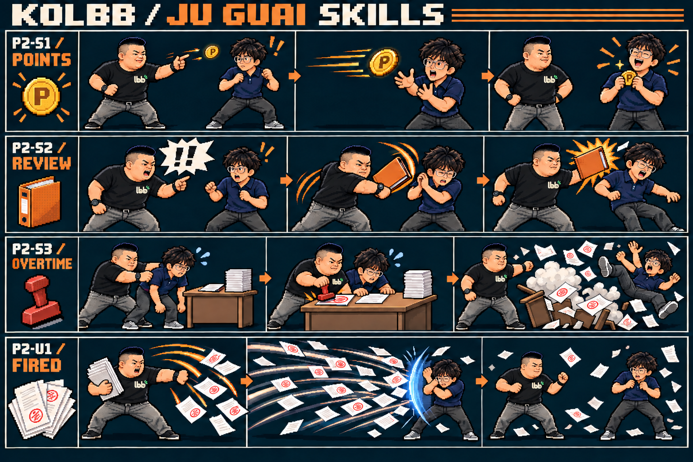

# KOLBB — 视觉圣经

版本：0.2（LBB Logo 统一） · 日期：2026-09-10 · 配套：[GDD](GDD.md) · [六张图板及生成记录](visuals/GENERATION_LOG.md)

**视觉目标：**普通职场人物走进有重量、有节奏的经典像素格斗场。人物像本人参考，动作像街机，办公室像真实办公空间；道具和演出承担荒诞喜剧。

本文沿用 GDD 的 U／D／R 标记。除用户确认的外观、画风、舞台与技能概念（U），全部尺寸、色值、动画和布局均为**首轮设计参数 D**。图板是方向参考；精确伤害、时序和有效攻击范围以 GDD 为准，不能从生成图中的纸张数量、火花大小或人物比例反推玩法。

## 1. 视觉语言与参考使用

### 1.1 三条美术原则

1. **先认人，再认招。**眼镜、发型、头型、体型与服装轮廓在缩小后仍成立；同角色在站、蹲、跳、受击时不换脸。
2. **有准备、有接触、有收势。**动作预备压缩身体，接触展开轮廓，收招回到稳定重心。攻击越重，前后姿态差越明显。
3. **角色强，背景静。**角色与可交互物边缘清楚；工位、窗景和标识降低对比度。纸张再多也保留脚底、人物和 HUD。

采用经典 2D 街机的手工像素簇、阶梯边缘、有限材质色阶与逐帧运动。人体保持日常成人体型，以约 5–5.5 头身作可读化概括。效果使用短线、碎片、漫画冲击星和代码／印章等角色符号。

避免照片拼贴、写实血污、光滑 3D、铠甲化角色、泛用肌肉格斗家、模糊像素滤镜、满屏霓虹，以及所有元素都用高饱和色。本文不增加其他角色、舞台或换装系统。

### 1.2 原始图与用途

| 文件 | 用途 | 必须提取的内容 |
| --- | --- | --- |
| [RajerWei.png](../raw_assets/RajerWei.png) | Rajer 的面部主参考 | 蓬松黑发、细金属框眼镜、脸型、五官间距、深色翻领上衣 |
| [JuGuai1.jpg](../raw_assets/JuGuai1.jpg) | JU 的身体与服装主参考 | 较宽厚体型、黑 T 恤、灰牛仔裤、腕表、双拇指姿势 |
| [JuGuai2.jpg](../raw_assets/JuGuai2.jpg) | JU 的笑容参考 | 短寸头、脸型、露齿笑与眼部压缩 |
| [JuGuai3.jpg](../raw_assets/JuGuai3.jpg) | JU 的胜利动作参考 | 举双臂、腰带、身形；手中原有物件不是必带战斗道具 |
| [JuGuai4.jpg](../raw_assets/JuGuai4.jpg) | JU 的讲话表情参考 | 讲话姿态、腕表、面部侧向特征；麦克风不是常驻武器 |
| [lbb-logo.png](../raw_assets/lbb-logo.png) | LBB 公司标识唯一主参考（U） | 米白色圆润小写 lbb、末尾 b 的杯形负空间、右上三道绿色点缀 |
| [鸡里奥官方原画副本](visuals/references/galio-birdio-official.jpg) | 召唤外观参考 | 白鸡服、红冠、黄喙、橙色背带服、石质巨臂与翅膀 |

照片背景、活动标语、水印和无关人物不进入角色精灵。Rajer 未提供完整下身，已确认补深色长裤与运动鞋；不从面部照片推断未给出的身高或真实身体数据。

鸡里奥按用户指定的加里奥皮肤制作；官方资料见 [Riot 皮肤页](https://www.leagueoflegends.com/en-sg/champions/galio/)与[对应原画](https://ddragon.leagueoflegends.com/cdn/img/champion/splash/Galio_6.jpg)。这些素材记录保留原来源；生成工具、照片与原画不被写成由本项目原创。

## 2. 画布、像素与色板

### 2.1 尺寸与显示

| 项目 | 初值 | 生产规则 |
| --- | --- | --- |
| 游戏逻辑画布 | 640×360，16:9 | 场景和 HUD 使用同一逻辑坐标系 |
| 默认窗口 | 1920×1080 | 最近邻 3 倍；支持 2560×1440（2K）4 倍；全屏用能容纳的最大整数倍，其余留边 |
| 战斗边界／脚底线 | x=16…624；y=292 | 精确碰撞见 GDD §3；镜头不随人物缩放或滚动 |
| HUD 安全区 | 顶部 y=0…56，底部 y=320…360 | 普通粒子不进入；高跳最高头部约 y=60 |
| 常态视觉高度 | Rajer 148px；JU 144px | 自鞋底至最高头发；不是固定受击盒高度 |
| 标准人体单帧画布 | 256×192 | 双人共用，透明；脚底锚点 (128,176) |
| 人物描边 | 外轮廓 1px，重点重叠边最多 2px | 不加平滑外发光；背光侧允许断开少量亮描边 |
| 阴影 | 地面椭圆：Rajer 40×8，JU 48×10 | 独立图层，30% 黑色；跳跃时缩小，不改变地面锚点 |

Godot 使用 `viewport` 拉伸与整数缩放、`keep` 长宽比，纹理使用 nearest；实现时替换当前空项目的 `canvas_items/expand` 配置。Retina 以实际渲染像素测试整数倍边缘，窗口变化不得拉宽人物。[Godot 多分辨率官方说明](https://docs.godotengine.org/en/stable/tutorials/rendering/multiple_resolutions.html)

所有游戏精灵在原生尺寸创作，1 个逻辑像素对应 1 个美术像素。图板本身是较高分辨率概念图，未保证逐块严格对应这个网格；进入生产必须重绘／整理为规定尺寸，不能以缩小图板替代像素制作。

### 2.2 基础色板

| 用途 | HEX | 使用规则 |
| --- | --- | --- |
| 深轮廓 | `#070C14` | 人体与关键道具最深边缘 |
| UI 深底 | `#0D1721` | 框体、菜单底、图板底 |
| UI 次底 | `#172735` | 未填充槽、选项区域 |
| 环境暗部 | `#293D50` | 后墙、设备与窗框 |
| 环境中部 | `#46616A` | 工位和地板主色阶 |
| 环境亮部 | `#8B9A9F` | 克制的玻璃和金属高光 |
| 正文／生命 | `#F0E7D5` | 名称、图标、高对比主文字 |
| Rajer 主提示 | `#45CBD1` | 角色氛围、1P 菱形标记 |
| JU 主提示 | `#F29646` | 角色氛围、2P 圆形标记、文件夹 |
| MAX／可用能量 | `#FFD166` | 强化提示、满格亮边 |
| 受伤／危险 | `#E55661` | 血条追伤、非物主汉堡提示 |
| 恢复 | `#79C878` | 食物恢复数字与十字 |

皮肤主参考色阶：阴影 `#985E49`、中间 `#C58B66`、亮部 `#E7B38C`，再按照片肤色做局部修订；不把脸画成均匀橙块。每种衣料 3 个主明度加 1 个轮廓色。人物单套常规色板目标 24–32 色，不包含透明色与独立特效。

**LBB Logo（U）：**统一依据用户提供的 [lbb-logo.png](../raw_assets/lbb-logo.png)。像素化保留完整圆润小写 lbb 的米白轮廓、最后一个 b 的杯形内部结构及右上三道绿色点缀；不再使用橙色单独 b 或普通大写 LBB 代替图形标识。源图外围透明／黑色展示区域不印到服装或道具上，像素版本省略柔光与立体浮雕，保留清晰轮廓。

JU GUAI 胸标建议原生宽 18–24px，放在原有左胸位置，随姿势透视变形并自然受手臂遮挡；基础黑色与备用酒红色服装使用同一米白／绿色标识。办公室主墙、杯子、纸箱、椅背外套和图板中的分层缩略图使用同一主参考，小尺寸保留完整字形轮廓与绿色点缀；浅色杯子和牛皮纸箱允许深色印刷版字形以保持对比。游戏标题 **KOLBB**、HR 门牌及橙色 UI／技能点缀仍是各自独立的文字或功能色。

提示不能只靠颜色：恢复用“＋”、伤害用“−”；槽位 1 用菱形＋数字 1，槽位 2 用圆形＋数字 2；MAX 有文字与条形计时，连接异常有文字。

## 3. 角色模型规范

### 3.1 RajerWei

- 148px 常态高度，窄于 JU 的胸肩，约 5.5 头身；保持普通成人的瘦至中等体型，不加夸张胸腹肌。
- 蓬松黑发顶部不规则但轮廓稳定，前额有分束；不能变成直立刺猬头或完全贴头短发。
- 眼镜是细银色金属框，轮廓近圆角方形，鼻梁细横线；正面头像至少保留两镜片、鼻梁和镜腿信息。
- 深海军蓝翻领短袖上衣，领口与纽扣线可见；深灰直裤；灰色运动鞋、浅鞋底。没有领带、手套、护具或永久背包。
- 常态略前倾，前手试探、后手靠近脸部；远程起手时肩膀先转、肘部后拉，再伸臂抛出。
- 表情四态：平静、得意轻笑、受惊、开怀胜利。得意不靠更换脸型；眼镜在受击与胜利中仍在。
- 备用色：上衣改为深青 `#174F57`／`#216673`／`#37808A` 三阶，裤鞋与肤色不变。头发、眼镜与身体轮廓不换。

参考图板的“BACK”是背侧观察概念，不视为一张可直接导入的精确后视图。游戏只需要左右战斗朝向；后视用于美术理解服装，不新增背向战斗机制。

### 3.2 JU GUAI

- 144px 常态高度，身体更宽，约 5 头身；腹部与胸肩形成稳定宽轮廓，腿部保持实际日常裤装形态。
- 黑色短寸头，头顶略平而非光头；侧面剪短。宽圆脸、厚实下颌与笑时缩小的眼睛要一致。
- 黑圆领短袖 T 恤，左胸为用户指定的米白／绿色小写 lbb Logo；灰牛仔裤、深腰带、深鞋；腕表为黑色，默认左腕。不能因职业设定改穿西装。
- 常态站距较宽，一只手指点／示意停下，另一只手护腰；打击时先压低重心再推肩，重量来自身体移动。
- 表情四态：傲然平静、露齿大笑、斥责喊话、意外受惊。胜利参考双拇指与双臂举起，两种之一按胜局奇偶选择，不另加随机机制。
- 备用色：上衣换暗酒红 `#3C1926`／`#60283A`／`#80394C`，灰裤、腕表、胸标、头发与肤色保持。

### 3.3 左右朝向、镜像与辨识

基础图集统一朝右。身体主层可水平翻转，但**胸标、文字、腕表和特定手持物单独分层**；为左右朝向分别设置挂点，确保文字不倒读、腕表不随意消失。需要露出同一解剖侧细节时补对应方向姿势，不通过旋转一整个人体精灵制造朝向。

镜像规则是玩家槽位规则：槽位 1 基础色，槽位 2 备用色；无论站在屏幕哪边，服装、菱形／圆形归属与名字都跟随操作者。非镜像角色均使用基础色，槽位标记仍保留。

投技、小黑屋、桌面演出必须准备两名角色各自的“施放”和“受招”状态；两名 Rajer 对战时，受招角色仍戴眼镜，不能临时替换为 JU 的体型。

## 4. LBB 办公室舞台

### 4.1 空间布局

| 区域 | 逻辑范围 | 内容与限制 |
| --- | --- | --- |
| 天花与窗景 | y=56…145 | 灯带、上海夜景的远景轮廓；不争夺 HUD 对比度 |
| 后墙 | x=0…640，y=80…228 | 中央为源图对应的小写 lbb 图形 Logo；右侧 `HR` 门区；不添加英文全称或旧橙色下划线 |
| 工位／行政隔间 | y=145…258 | 显示器、椅子、打印机、文件、绿植；实体全部位于角色之后 |
| 战斗走道 | y=258…319 | 清晰地毯地面、脚底线 y=292；没有前景桌腿、杂物或电缆遮脚 |
| 底部 UI 区 | y=320…359 | 低对比地面延伸，留给 POW／MAX |

图板中场景是嵌在展示板内的构图参考；其缩略分层不是实际透明背景 PNG。生产时按本表重新搭建 640×360 场景，保留场景语言，不照搬展示板边框和文字标题。

### 4.2 分层、灯光和动效

从后向前：远景／后墙 → 工位与玻璃隔间 → 地板 → 地面标记与影子 → 食物与人 → 人前命中特效 → HUD。小黑屋等共同演出覆盖世界层但低于 HUD。

- 主光来自左上方偏冷的办公室灯，右侧台灯给局部暖光；人物仍使用统一左上明面，不逐灯重算光照。
- 办公室本体不滚动，没有假视差；仅允许远窗少量灯光变换、显示器闪动、打印机吐纸三类环境循环。
- 窗光 4 帧／240 帧循环，显示器 3 帧／180 帧循环，打印机 6 帧／360 帧循环；三个固定相位错开，不消耗战斗随机数。
- 装饰纸张只在背景、绝不落到脚底线冒充积分、食物或 U1 攻击。
- 地面实体接触感来自阴影与脚步，不使用镜面反射、体积雾或大面积闪光。

## 5. HUD、菜单与文字

图板为一帧示例状态；时间、血量、能量和延迟数字是展示数据。正式布局以以下坐标为准。HUD 中英文仅为画面示意，菜单、提示、出招表使用中文，角色显示名按用户指定保留英文。

### 5.1 实战布局契约

所有矩形为 `(x,y,w,h)`，单位逻辑像素。

| 元素 | 槽位 1 | 槽位 2／公共 | 规则 |
| --- | --- | --- | --- |
| 头像 | (8,8,36,36) | (596,8,36,36) | 只裁头像，不能挡名字 |
| 名字与槽位符号 | (50,7,228,14) | (362,7,228,14)，右对齐 | RajerWei／JU GUAI，旁置菱形 1／圆形 2 |
| 生命条 | (50,24,228,12) | (362,24,228,12) | 左侧从外向中填充；右侧镜像；两条各有 1px 轮廓 |
| 胜局标记 | (52,42) 与 (64,42)，7px 菱形 | (588,42) 与 (576,42)，7px 圆形 | 每侧两枚；获胜填金，其余空心；形状与槽位对应 |
| 时间 | — | (292,8,56,28) | 大号两位数字；低于 20 秒转危险色，不闪烁 |
| 在线延迟／异常 | — | (284,39,72,13) | 正常显示 RTT 估计；异常用“等待网络”文字替换 |
| POW 三格 | (16,338,216,12) | (408,338,216,12) | 3×70px，格间 3px；按 0–300 填充，整格完成有金边 |
| POW 标签 | (16,323,40,12) | (584,323,40,12)，右对齐 | 不增加第四个伪能量格 |
| MAX 时间条 | (64,322,168,8) | (408,322,168,8) | 仅激活侧显示；标签邻接且与 POW 不重叠 |
| 连击数 | (16,104,104,24) | (520,104,104,24)，右对齐 | 只从 2 连击显示；结束 60 帧淡出 |

生命条主填充为米白，受伤区红色停留 18 个表现帧后用 12 帧追上当前生命；恢复区绿色停留 12 帧再转米白。实际生命立即变化，追伤条不参与玩法。暂停时这些 UI 追赶动画冻结，联机菜单不冻结对局 HUD。

### 5.2 字体与菜单

- 中文选用 [Noto Sans CJK SC](https://github.com/notofonts/noto-cjk) 的 Regular 完整字体，生产时随包放入对应字体许可证；中文说明 16px，菜单选项 18px，标题 24px。首版直接打包完整字体，不能依赖目标 Mac 恰好装有某字体。
- HUD 英文名 12px；数字采用自制等宽像素字形，时间 24px，槽位／能量标签 10px。中文字不能被硬塞进 8px 像素格。
- 窗口缩放由整个逻辑画面整数放大，不对单个文字或头像额外做非整数缩放。像素数字不平滑过滤；中文保持清楚的笔画，不强行做装饰破损。
- 菜单使用深底平面框、1px 米白边、明确的焦点箭头；选项之间至少 10px 空隙。禁用项保留文字并说明原因，例如“房间已满”，不只灰掉按钮。
- 标准文案：单机对战／互联网对战／创建房间／加入房间／准备／取消准备／再战／重新选人／返回菜单／出招表／设置。
- 对局失败提示使用 GDD §9 的确切含义；退出与掉线不显示普通“胜利”，设置页不给人“联机已暂停”的错觉。

## 6. 八招与状态的视觉脚本

### 6.1 通用表现层级

| 事件 | 形状／色彩 | 默认表现预算 |
| --- | --- | --- |
| 轻打击命中 | 小型斜向米白星，3–5 个碎片 | 16×16 火花，6 表现帧；不震屏 |
| 重打击命中 | 扁平放射米白＋角色点缀色 | 32×24 火花，8 帧；震屏振幅 2px、6 帧 |
| 防御 | 青蓝空心扇弧，接触面贴近手臂 | 24×32，6 帧；不用血色 |
| 食物恢复／扣血 | ＋200／＋50 绿色；−200 红色 | 浮动数字 30 帧，上浮 12px；不盖住面部 |
| MAX 启动 | 脚边窄环、肩边金色断线，MAX 字样 | 8 帧冲开；普通启动实际可受击 |
| MAX 持续 | 轮廓少量青金／橙金像素，每 12 帧一轮 | 光效不使全身轮廓变粗，也不暗示无敌 |
| 超必杀停顿 | 背景降亮 35%，角色维持亮度，短横线 | 12 网络帧；屏幕不连续白闪 |
| KO | 冻结接触姿势后红／米白大字 | 只在确认终局帧出现，无额外伤害特效 |

震屏只作用于渲染偏移，按整数像素移动并裁到世界视口，HUD 固定；不修改脚底位置或攻击盒。设置关闭震屏后改用更长 2 帧的火花停留，战斗定格时长不变。减少闪光开启时超必杀背景只降亮 15%，取消全屏亮色闪帧。

### 6.2 RajerWei 四招

| ID | 起手 → 接触 → 结束 | 与玩法的对应 |
| --- | --- | --- |
| P1-S1 | 肩向后转、手握小棕团 → f16 伸臂抛出 → 对手脸部棕色漫画贴花、惊愕后仰 | 飞行道具 18×18；贴花不是第二次攻击；前 18 帧为糊脸姿势 |
| P1-S2 | 从身侧取汉堡 → f24 向前低抛 → 单个汉堡落地，合格拾取时嘴边短动作与绿色＋ | 汉堡可辨认面包、菜叶与肉饼；落地待激活时标记空心，可拾取后实心 |
| P1-S3 | 抬手向上示意、预警落点出现 → f28 鸡里奥砸入并击飞 → f32 抛出三片披萨后离开 | 预警画在实际落点；图板为了分镜把示意光圈放近施放者，生产时必须遵循前方 144px 锁点 |
| P1-U1 | 前冲出现深色小房门 → 关闭后两人完整衣着剪影、三次小皮鞭漫画火花 → f60 扣血后门开，对手摔出 | f24/36/48 鞭击只是视觉；伤害仅一次；不出现裸露、血伤或额外家具 |

鸡里奥召唤原生视觉包围框约 224×224，落地人物实体仍由脚底锚点定位；翅膀和碎尘可以超出 112px 伤害直径，但预警圈必须准确标示伤害落点。白色鸡服以灰阶分块，橙背带提供体块分隔；红冠与黄喙在缩小后仍可辨认。

披萨每片 20×18，三角轮廓、芝士黄色、红色小配料；运行时必须恰好三片独立实体。图板中的表现间距不等于实际落点。汉堡 24×20，不与棕色飞行道具共用外形或色阶。

小黑屋使用舞台道具式深木框、暖色小窗与简短“小黑屋”门牌。图板英文 `PROP ROOM` 是概念标签，正式资产替换为“小黑屋”，门牌单独绘字。阴影保持两种体型、Rajer 的眼镜／发型轮廓，门外角色不在演出中重复出现。

### 6.3 JU GUAI 四招

| ID | 起手 → 接触 → 结束 | 与玩法的对应 |
| --- | --- | --- |
| P2-S1 | 手指夹币、手腕一弹 → f18 金币直线飞出 → 对手双手捧币并大笑 | 飞行币 16×16，中央 P；受击手中币是附属层，不产生地面可拾取物 |
| P2-S2 | 前倾指点、气泡“绩效？” → f10–12 气泡压迫 → f20–23 文件夹拍击 | 气泡和文件夹分两次接触；两个火花不能合成一次重击表现 |
| P2-S3 | 张臂抓取 → 临时桌子升起，把对手按向文件，f36 盖章 → 桌子收走、对手弹开 | 桌子只在 54 帧共同演出存在；图板桌碎是视觉退出方向，生产采用收走／纸屑消散，不增加破坏机关 |
| P2-U1 | 拿起一扇文件、身体后压 → 五波纸流带红章向前铺开 → 收势后残纸散去 | 可被防；纸带的装饰范围大于实际脚底上方 8–72px 的攻击带 |

积分使用金色圆币配中心 P，不使用现实货币数值。橙色文件夹约 40×32，纸页与夹体分层；印章约 20×24，落章接触帧需要红色印迹扩散 2 帧。

文件大招分为“前景少量大纸”和“背景多数小纸”，最多 30 张装饰纸同时可见；单张常规纸 12×16，近景纸 20×26。纸张在同一瞬间对人物轮廓的覆盖目标不超过三分之一，脚底附近始终留空隙。HUD 层不接收任何纸张覆盖。五波命中段各有独立短火花，不能用密集纸粒子伪装更多命中次数。

### 6.4 两名受招者与食物归属

糊脸与大笑各需 Rajer、JU 两套角色姿势，共 **四种专属受击动画**。糊脸保持眼镜镜框可辨，棕色贴花不能擦掉人物全部五官；大笑明确是受击僵直，持续时长跟随 GDD，不能接到普通胜利循环。

食物上方 6px 显示归属：槽位 1 为青色菱形内数字 1，槽位 2 为橙色圆形内数字 2。非物主汉堡另加红色短横与“−”小记号；本地玩家看到的颜色不改变世界实体真实配色。披萨的标记一致，但非物主没有扣血提示。

食物的淡出只发生在最后 30 帧寿命，交替 4 帧显示／4 帧隐藏；判定始终存在至寿命为 0。减少闪光时改为恒定半亮度，不改变激活或过期时间。

## 7. 动画与资源生产规格

### 7.1 时序优先级

战斗模拟以 60 帧为单位，动画可以多帧持同一姿势。**独立画稿数量不等于有效帧数。**动画接触姿势必须覆盖 GDD 指定的所有有效帧；动画播放器不得决定什么时候伤害生效。

视觉状态优先级：共同演出 → KO／倒地／起身 → 受击／专属受击 → 防御接触 → 当前攻击 → 翻滚／跳跃 → 蹲／跑／走 → 待机。食物吃东西仅在允许拾取的自由动作上叠加，不覆盖受击。

### 7.2 每个角色的基础动作清单

| 动画 | 独立姿势数 | 展示时序或锚点要求 |
| --- | ---: | --- |
| idle | 6 | 每张 8 帧，48 帧循环；脚底不动，胸肩呼吸最多 1px |
| walk_forward | 6 | 每张 6 帧；交替支撑脚，不上下跳整个身体 |
| walk_back | 6 | 独立后退步态，每张 6 帧；不简单倒放前走 |
| run | 6 | 每张 4 帧；双脚离地姿势仍以相同逻辑脚锚点定位 |
| backstep | 4 | 每张6帧，共24帧后撤；视觉轻身后移不代表空中或无敌 |
| crouch_in／hold | 2＋1 | 进入姿势每张 2 帧，保持姿势可循环；模拟蹲盒立即切换 |
| jump_prepare／rise／fall／land | 2／1／1／2 | 普通预备 2+2 帧，大跳 2+3；落地 2+2；上下位移由模拟决定 |
| guard_stand／guard_crouch | 各 2 | 第一张接触，第二张持防；抬臂形状不同于进攻 |
| hurt_ground／hurt_air | 3／2 | 先压缩、再后仰、最后恢复；硬直不足时按接触优先截断 |
| knockdown／getup | 3／3 | 按软／硬倒地持帧；起身 12 帧为 4+4+4 |
| roll | 7 | f0–3 两预备张；f4–15 三翻滚张各4帧；f16–29 两恢复张各7帧 |
| intro | 6 | 120 帧内完成，不额外生成可交互道具 |
| victory | 6 | 60 帧动作＋末张保持；JU 第二胜姿可复用参考动作的另6张，列为补充而非阻塞资源 |
| max_start | 4 | 普通 MAX 启动 12 帧，每张3帧；快速 MAX 使用末两张的6帧表现 |
| eat_overlay | 2 | 道具贴近嘴、吞下；附属层各3帧，移除前后不改变攻击盒 |
| hit_poop／hit_laugh | 3／4 | 仅在专属硬直窗口播放，之后切普通受击；每人都需要 |

所有基础动画保持同一服装与面部模板；同一姿势的备用配色由调色表替换完成，不新增第二套不同轮廓动画。

### 7.3 普通攻击、投技与技能

| 组 | 每人所需画稿 | 分配规则 |
| --- | --- | --- |
| 6 个轻普通攻击 | 每招 4 张，共 24 张 | S 分前两张，A 一张接触，R 一张回收；奇数帧余数放后半段 |
| 6 个重普通攻击 | 每招 6 张，共 36 张 | S 两张、A 两张、R 两张；不可把接触画稿提前到有效帧之前 |
| 普通投：施放者 | 6 张 | 对准抓、拉、转、摔、放、恢复；30 帧演出由数据表指定保持时长 |
| 普通投：受招者 | 4 张 | 被抓、失衡、抛出、着地；前背投共用基础姿势，位置由演出轨道决定 |
| P1-S1／P2-S1 | 各 6 张角色动作 | 两张蓄势、两张释放、一张跟随、一张收回；飞行物另制4帧循环 |
| P1-S2 | 6 张角色动作 | 取物、下压、抛出、手空、回身、恢复；汉堡轨迹独立实体 |
| P1-S3 | 6 张施放动作＋8张召唤 | 召唤为下降2／压地2／起身1／抛披萨2／退出1；关键生成帧由 GDD 驱动 |
| P1-U1 | 8 张施放者＋6张受招者 | 前冲、进门、3次鞭击关键姿态、出门；房屋另制开关门4帧 |
| P2-S2 | 8 张角色动作 | 气泡起手2、指点2、文件夹挥动2、回收2；两有效段必须分开 |
| P2-S3 | 8 张施放者＋6张受招者 | 抓、按、举章、盖章、推开、恢复；桌子出现／退出4帧 |
| P2-U1 | 8 张角色动作 | 起手2、放纸4、收招2；五波由同一纸页族与五个事件产生 |

上述是生产下限与持帧方案，既有基础受击姿势可复用但不能删掉关键接触／释放姿势。镜像对战意味着 U1／S3 受招动画也必须为施放者同角色制作，不能只做好异角色受招。

### 7.4 图集、命名与目录

游戏资产目录规划：`assets/fighters/`、`assets/stage/`、`assets/props/`、`assets/vfx/`、`assets/ui/`、`assets/audio/`。本次仅创建 `docs/visuals/` 的概念材料，不在这些未来目录放占位图。

| 类型 | 文件／单元规则 |
| --- | --- |
| 人体 | `rajer_wei_core.png`、`rajer_wei_normals.png`、`rajer_wei_specials.png`；JU 使用 `ju_guai_` 同结构；每单元256×192，锚点128,176 |
| 图集 | 最长边≤2048，建议8列；帧矩形、名字、保持帧数、锚点写配套 Godot Resource；不由文件名猜行列 |
| 小道具 | 单元32×32，汉堡锚点16,28、披萨16,26、币16,16、大便16,16；实际不透明范围见§6 |
| 大道具 | 鸡里奥单元256×256，锚点128,232；小黑屋256×224，锚点128,208；桌子192×128，锚点96,112 |
| 特效 | 小火花32×32、大火花64×64；文件纸页32×32；落地圈128×32；均独立透明PNG |
| 背景 | 各层640×360，左上锚点0,0；无需为固定镜头预留长卷背景 |
| 头像 | 原生48×48，另制36×36 HUD简化版本；不得通过非整数缩小头像满足HUD |

PNG 为 sRGB、8位RGBA、straight alpha；空白像素 alpha=0，实体边缘原则上 alpha=255。烟尘、影子和玻璃的半透明放独立层，不允许“黑白棋盘画进图片”冒充透明。相邻单元之间保留至少2px透明边界，像素滤镜 nearest，关闭 mipmap。

同一角色所有动作锚点固定；超出单元的重攻击先扩大该图集统一单元并同步元数据，不能静默裁掉拳脚。根位移来自战斗模拟；只有演出轨道明确拥有角色位置时才能覆盖普通位移。

资源中的 `move_id` 使用 GDD 的 RW-5A／JG-5A／P1-S1 等稳定编号；`owner_slot` 只存在于运行实体，不写死在 P1 文件名里。中文技能名为显示文本，可独立更名但不能失去编号映射。

## 8. 图板制作、审查与交付门槛

### 8.1 六张概念图板

| 图板 | 文件 | 用途 |
| --- | --- | --- |
| 01 | [RajerWei](visuals/01-rajerwei.png) | 身份、服装、动作气质与备用色 |
| 02 | [JU GUAI](visuals/02-juguai.png) | 体型、表情、服装、腕表与胜姿 |
| 03 | [办公室](visuals/03-office.png) | 舞台构图、分层、色板与灯光 |
| 04 | [HUD](visuals/04-hud.png) | 角色／背景对比及信息层级 |
| 05 | [Rajer 四招](visuals/05-rajerwei-skills.png) | 关键动作、召唤外观、三披萨与小黑屋顺序 |
| 06 | [JU 四招](visuals/06-juguai-skills.png) | 积分受击、面谈两段、桌面抓取与可防文件波 |

生成使用内置 `image_gen`，先以原图制作两张人物板，再以人物板约束场景、HUD 和技能分镜。提示词、参考角色、工具输出路径与修订理由见[生成记录](visuals/GENERATION_LOG.md)。工具不能指定或核实“image2.5”，因此不将图板标为该模型产出。

### 8.2 本次图板审查与概念边界

- 逐张检查脸部、体型、服装、眼镜／腕表、技能动作和文字；办公室多余生成标语单独修订，避免把随机英文当 LBB 的正式全称。
- Logo 修订覆盖02人物板、03办公室、04实战HUD、05与06技能分镜中的JU GUAI及既有公司标识；01 Rajer外观板没有公司胸标，不新增标识。
- 01／02 是人物模型参考，05／06 是时序分镜；姿势的画稿比例允许为了讲清动作放大，最终角色高度与锚点按 §2 统一。
- 05 清楚显示恰好三块披萨、鸡里奥白鸡服／橙背带、糊脸和小黑屋；06 显示拿币大笑、两段面谈、桌面盖章、文件被防。
- 05 的光圈位置、分镜中的抛物线和 06 的满屏纸张是演出描述；具体坐标、速度、命中带和生成时点按 GDD 制作。
- 生成板的样字不作为正式 UI 字库；小黑屋门牌、面谈气泡等中文文字须在生产时用独立文字层替换。
- 本次不宣称完成原生精灵网格、透明通道、逐帧流畅性或运行时性能验收；六张图板均为完整不透明概念图。

### 8.3 未来游戏资产验收

1. **身份检查：**48px头像仍能区分两人；镜像备用色不改变脸；糊脸、大笑和抓取不丢眼镜／腕表。
2. **像素检查：**100%原生与200%整数查看，边缘无模糊、无光边、透明无棋盘；所有帧脚锚点稳定，左右朝向无文字倒读。
3. **时序检查：**把攻击盒覆盖层与原画同时显示，起手不提前命中、最后有效帧仍是接触姿势、收招不被视觉省略。
4. **战斗可读性：**镜像时看清归属，食物满屏仍能区分币和披萨，文件大招可见防御与脚底，MAX轮廓不暗示霸体。
5. **界面检查：**640×360和1280×720均无文本溢出；长中文异常提示可换行；所有菜单焦点能用键盘走到。
6. **可访问性：**灰度检查归属形状仍不同；减少闪光与关闭震屏不改变战斗判定；核心文字对比度目标至少4.5:1。
7. **性能检查：**两台Mac运行八招峰值、镜像双召唤与回滚；按 GDD V02 记录真实帧时，不以概念图数量估计性能。

修改规范时先更新 GDD 的行为与数值，再同步本文动作时序、图板注释和资源清单；旧图如果只能表达构图，应保留明确注释，不能悄悄成为第二套玩法规则。
