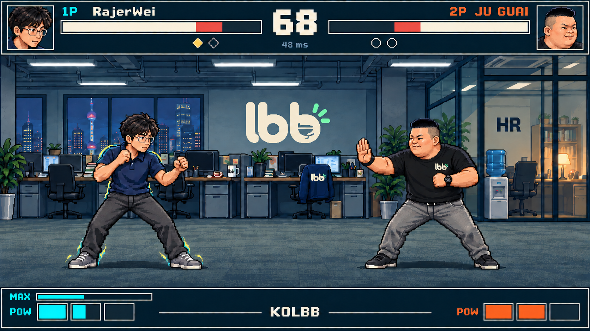

# KOLBB — 图板、生成记录与文档审查

日期：2026-09-10 · 交付：[GDD](../GDD.md) · [视觉圣经](../VISUAL_BIBLE.md)

## 1. 最终交付

共六张最终概念图板，全部为内置 `image_gen` 生成。初版先制作两张角色板，再用于其余图板的一致性约束；办公室与 HUD 各修订一次，初版共 8 次生成调用。此后按用户提供的 LBB Logo 更新其中五张，另使用 8 次图像编辑，详见第5节。工具没有可核实的模型选择参数，因此未标称 Image2.5。

| 图板 | 原生尺寸 | 状态 |
| --- | --- | --- |
| [01 RajerWei](01-rajerwei.png) | 1536×1024 | 脸、眼镜、发型、深色翻领上衣、下身补全、备用色与表情 |
| [02 JU GUAI](02-juguai.png) | 1536×1024 | 黑T与备用酒红T的左胸统一为用户提供的lbb Logo |
| [03 LBB 办公室](03-office.png) | 1672×941 | 墙标、杯子、纸箱、外套与分层预览统一新Logo，保留HR |
| [04 实战 HUD](04-hud.png) | 1672×941 | 公司与JU胸标统一新Logo，血条、POW、MAX、时间和延迟保留 |
| [05 Rajer 四招](05-rajerwei-skills.png) | 1536×1024 | JU对手胸标统一新Logo；糊脸、汉堡、3片披萨、小黑屋完整 |
| [06 JU 四招](06-juguai-skills.png) | 1536×1024 | JU各技能胸标统一新Logo；大笑、面谈、盖章、文件风暴完整 |



生成的办公室与HUD为近16:9原生尺寸，未为凑比例重采样。全部图板为RGB不透明PNG，不是已检验透明通道和锚点的生产图集。正式游戏画布、640×360像素规格和逐帧时序由两份文档规定。

## 2. 本次实际审查

- 已逐张查看六张最终图板；核对人物辨识、服装、关键动作、三片披萨、文件风暴下的防御姿势与HUD可读性。
- 人物、技能分镜里同名角色的面部与体型总体一致；保留“概念比例／样字不直接作为生产资产”的明确界线。图板英文标签是制作标签，中文气泡与门牌在生产时按视觉圣经替换。
- 办公室初稿额外添加 `LESS BORING BUSINESS` 等字样，已用内置图像编辑修正；HUD初稿右血条悬空居中，已修正为从右端填充。
- 文档静态检查核对24个唯一普通攻击条目、8个唯一技能参数条目、Markdown表格列数和本地链接／图片文件存在性。
- 交叉审查已补齐翻滚及后撤步可受投、普通投与超必杀捕获例外、房间重编号时机、食物整数轨迹、网络长丢包的输入补发和等待期间采样规则。
- 仅做文档与概念图审查。GDD列出的C01–C15、N01–N07、V01–V02为未来游戏实现验收场景，未运行战斗、CPU、服务器、回滚或性能测试。

## 3. 参考来源

- 用户人物图：[RajerWei](../../raw_assets/RajerWei.png)；[JU 1](../../raw_assets/JuGuai1.jpg)、[JU 2](../../raw_assets/JuGuai2.jpg)、[JU 3](../../raw_assets/JuGuai3.jpg)、[JU 4](../../raw_assets/JuGuai4.jpg)。
- 鸡里奥：[Riot官方角色皮肤页](https://www.leagueoflegends.com/en-sg/champions/galio/)、[官方原画](https://ddragon.leagueoflegends.com/cdn/img/champion/splash/Galio_6.jpg)，本地参考副本 [galio-birdio-official.jpg](references/galio-birdio-official.jpg)。下载仅用于本项目指定形象参考。
- 所有源图保持原样；图板从工具原始输出复制到本目录。未用程序绘画或图像后处理替代图像生成，也未抹掉原始参考文件的水印。

## 4. 调用与原始提示词

以下保存实际发送给内置工具的完整英文提示词。引用的初稿由各调用的“原始输出”路径保留；最终文档只依赖本目录内的最终PNG，不依赖这些Codex缓存路径。

### 01-rajerwei — RajerWei 外观

- 工具：`image_gen.imagegen`，使用 `referenced_image_paths`。
- 参考：raw_assets/RajerWei.png。
- 原始输出：`/Users/linyiming/.codex/generated_images/01a08995-b529-7171-a7af-fb2a2b3f64db/exec-ccdbab38-9744-499d-85ee-0b0befe190c1.png`。
- 采用情况：采用。

```text
Create ONE polished landscape game art direction reference board for KOLBB, a classic 2D pixel-art arcade fighting game. Use the attached RajerWei face photograph as the identity reference. This is character concept art, not a photograph and not a production spritesheet. Preserve recognizable face proportions, fluffy parted black hair, thin round-square SILVER METAL glasses, and the dark navy collared polo. Full body: ordinary lean-to-average adult build, dark straight trousers, grey sneakers. Do not add armor, gloves, ties, martial arts uniform or heroic muscles. Roughly 5.5 heads tall. Classic late-1990s hand-placed pixel clusters, strong readable outlines, 3-step material shading, NO smooth painting, NO 3D rendering, NO blurry pixel filters. Natural skin tones. He is a fictional witty programmer fighter.
Board: restrained dark navy presentation background #0d1721, thin warm ivory rules, orange tiny index, cyan accent #45cbd1. Title exactly "KOLBB / RAJERWEI". Large main full-body three-quarter fighting stance facing RIGHT, shown with crisp nearest-neighbor style enlarged pixels. Beside it show consistent side fighting stance and back view, two matching costume swatches: original navy and alternate dark teal polo (same trousers, glasses and silhouette). Across bottom show four large pixel portrait expressions: neutral, smug smile, shocked, victorious; retain same identity and eyewear throughout. A small walking and crouch pose strip, clearly a concept key-pose strip, not a tiled atlas. Very clean editorial grid, generous separation between figures, no overlap, each pose complete with feet. A thin baseline below all standing poses. Small exact English labels only: "STANCE", "SIDE", "BACK", "ALT", "EXPRESSIONS". No extra paragraphs, watermarks or signatures. Preserve photograph identity while adapting to pixel art. Landscape 3:2 composition, enough resolution for clear pixel edges.
```

### 02-juguai — JU GUAI 外观

- 工具：`image_gen.imagegen`，使用 `referenced_image_paths`。
- 参考：raw_assets/JuGuai1.jpg、JuGuai2.jpg、JuGuai3.jpg、JuGuai4.jpg。
- 原始输出：`/Users/linyiming/.codex/generated_images/01a08995-b529-7171-a7af-fb2a2b3f64db/exec-dfef6bd4-ab70-4757-a77d-ec4a6ea59bed.png`。
- 采用情况：采用。

```text
Create ONE polished landscape character art direction board for KOLBB, a classic 2D pixel-art arcade fighting game. The four attached JU GUAI photographs are identity, physique, clothing and expression references, all of the same adult character. Preserve the very short black crew cut with clipped sides, broad round face, broad stocky body, characteristic smile, black crew-neck short-sleeve T-shirt with a SMALL orange chest emblem, grey jeans, black belt, dark everyday shoes and BLACK WRISTWATCH ON HIS LEFT WRIST. Do not make him slim, a bodybuilder, a monster, or dress him in a suit. No armor. About 5 heads tall, ordinary stocky adult, strong wide planted stance. The game character is a fictional domineering office administrator. Not a photo collage.
Same art system throughout: classic late-1990s hand-placed pixel clusters, readable dark outlines, 3-step shading, crisp enlarged pixel edges, NO 3D, no gradients or smooth painting. Palette dark navy #0d1721 presentation background, ivory rules #f0e7d5, warm orange #f29646 character accents. Title exactly "KOLBB / JU GUAI". Large full-body three-quarter fighting stance facing RIGHT, a raised palm as if lecturing and the other hand near waist. Adjacent consistent side pose and back pose, all feet visible. Original black T-shirt and ALT dark burgundy T-shirt color variant with same grey jeans, watch and face. A bottom portrait strip with four large expressive pixel faces: smug neutral, toothy laugh, shouting, surprised. Additional two small complete-body key poses: both thumbs up; arms raised in victory (from references). An office folder may appear next to his portrait as a skill prop but not permanently replace his empty-hand fighting stance. Clear editorial grid, baseline, ample separation. Short exact English labels only "STANCE", "SIDE", "BACK", "ALT", "EXPRESSIONS". No paragraphs, no reference-photo background, no watermarks or signatures. Landscape 3:2.
```

### 03-office — 办公室初稿

- 工具：`image_gen.imagegen`，使用 `referenced_image_paths`。
- 参考：01-rajerwei、02-juguai 两张生成图板。
- 原始输出：`/Users/linyiming/.codex/generated_images/01a08995-b529-7171-a7af-fb2a2b3f64db/exec-f4dc2870-941c-416c-a673-fab2bc40e219.png`。
- 采用情况：初稿；最终采用对应 revision。

```text
Create ONE exquisite pixel-art ENVIRONMENT DESIGN BOARD for KOLBB, a humorous office arcade fighting game. Use the attached two character design boards ONLY to match their crisp 1990s pixel-art language and relative scale; do not repeat their layouts or portraits. This board is primarily an EMPTY SIDE-VIEW FIGHTING STAGE, no active combat, no HUD. Landscape 3:2 board, dark navy #0d1721 editorial surround and warm ivory #f0e7d5 thin dividers, tiny cyan/orange section accents. Title exactly "KOLBB / LBB OFFICE". The top two thirds contain ONE large 16:9 pixel-art scene: a Shanghai office after work, flat side-on gameplay plane, desks and monitors in the background, glass HR office at far right, modest city windows at rear, a clear LBB wordmark on back wall, fluorescent cool lighting with a warm desk lamp on right. Modern everyday office, subtly ridiculous work culture, no cyberpunk neon, no Japanese dojo. The fighters' unobstructed horizontal floor is along the bottom quarter of scene. ALL chairs, cables, folders and desks are behind that playable strip; no foreground clutter obscuring ankles. Horizon, furniture and ceiling all consistent. Native logical layout 640x360 with floor baseline y=292, stage visual rendered with enlarged crisp square pixel clusters. Stage background subdued desaturated slate teal, lighter value behind dark-clothed fighters. Foreground ground solid muted grey-green; no mirror floor reflections. Reserve quiet top 56 logical px for HUD and bottom 40 for gauges. Lower third of board: four small clear layer previews across a row, labeled exactly "BACK WALL", "WORKSTATIONS", "FLOOR", "ACCENTS". Bottom small 8-color palette swatches, and one tiny Rajer silhouette and one tiny broad JU GUAI silhouette for scale only. No numbers or long paragraphs. Classic hand-drawn arcade pixel art, discrete color steps, no smooth painting, no 3D, no excessive gradients. A single arena, same furniture in every layer preview.
```

### 04-hud — HUD 初稿

- 工具：`image_gen.imagegen`，使用 `referenced_image_paths`。
- 参考：01-rajerwei、02-juguai、03-office 初稿。
- 原始输出：`/Users/linyiming/.codex/generated_images/01a08995-b529-7171-a7af-fb2a2b3f64db/exec-6cd1e9d6-94cc-4984-8729-80ceabe97fba.png`。
- 采用情况：初稿；最终采用对应 revision。

```text
Create ONE 16:9 landscape in-game HUD VISUAL REFERENCE screenshot for KOLBB, the pixel-art office fighting game. Reference inputs: Rajer character board, JU GUAI character board, office environment board. Use the SAME ordinary adult characters faithfully, with glasses/navy polo/slim-to-average build for Rajer and short crew-cut/stocky build/black tee/grey jeans/left wristwatch for JU GUAI. Use the SAME side-view LBB office, desks strictly behind fight space and uncluttered floor. Main back wall only "LBB", HR glass door only "HR", no invented English corporate slogans. The whole output is ONE polished 16:9 game screen, NOT a character sheet, NOT a web page, NOT a collage and NOT surrounded by editorial board labels.
Design as native logical 640x360 with crisp integer-enlarged pixel art. Ground y=292. Rajer left with feet around (185,292), height148, facing RIGHT; JU GUAI right feet (465,292), height144, facing LEFT. Both in characteristic fighting stances, each fully visible; generous space between. Render coherent lifelike character pixel art matching supplied identities, no 3D. Clear dark character outlines against desaturated lighter slate office. Rajer has a restrained cyan-gold MAX edge aura at shoulders and feet, no full body glow, no attack active.
HUD: top 56 logical px reserved for compact interface. A 36x36 portrait of Rajer at far upper left, JU GUAI upper right. Exact names "RajerWei" and "JU GUAI", small "1P"/"2P" labels. Two long mirrored horizontal HP bars below names, warm ivory remaining HP with red recent-damage trailing portion and charcoal missing HP; left about75% full, right60%. Center timer large exactly "68". Two small round-win dots below each bar, left one filled and one empty, right both empty. At center just under timer tiny text "48 ms" for online indicator.
Bottom logical y=320..351 reserved for gauge strips: three SEPARATE stock cells per side labeled "POW". Left one full stock and half next stock, right two full stocks; clearly three cells total each. Above left POW, ONE thin cyan/yellow duration bar labeled "MAX" visibly half full. Right has no MAX label or aura. Small centered "KOLBB" at bottom. All HUD frames dark navy with 1px warm ivory border, sharp pixel sans text, no rounded floating web cards, no extra buttons, no skill shortcut row. Accent cyan for 1P and orange for 2P plus shape-coded small diamond vs circle markers. HUD is clear and dominates background signage by contrast. Background quieter under top and bottom UI. Preserve all fighters' feet and their faces; no decorative overlay crosses the central action. This is concept reference, no hitbox debug drawing, no performance graph, no watermark.
```

### 05-rajerwei-skills — RajerWei 四招分镜

- 工具：`image_gen.imagegen`，使用 `referenced_image_paths`。
- 参考：01-rajerwei、02-juguai、references/galio-birdio-official.jpg。
- 原始输出：`/Users/linyiming/.codex/generated_images/01a08995-b529-7171-a7af-fb2a2b3f64db/exec-58a643ad-00f5-47a0-83b0-9107ec7ba935.png`。
- 采用情况：采用。

```text
Create ONE clear landscape 3:2 pixel-art ANIMATION STORYBOARD for KOLBB. Attached inputs: RajerWei character board = exact protagonist model; JU GUAI character board = exact opponent model; Birdio official splash = identity reference ONLY for the summoned chicken-suited Galio. Retain Rajer's silver metal glasses, fluffy black hair, navy polo, dark trousers and grey sneakers. JU GUAI is broad, short crew cut, black tee and grey jeans. Same classic 1990s crisp pixel art as character boards, navy editorial background, cyan highlights, thin ivory panel separators. Title exactly "KOLBB / RAJERWEI SKILLS". FOUR wide horizontal storyboard rows, each with THREE clearly separated sequential action panels; complete bodies, no panel overlap, no text paragraphs. Exact row labels "P1-S1 / THROW", "P1-S2 / BURGER", "P1-S3 / BIRDIO", "P1-U1 / DARK ROOM".
Row 1: Rajer winds up and throws a small cartoon brown poop projectile; projectile travels with a short brown arc; JU GUAI's face comically smeared with cartoon brown splat, startled stiff recoil. Non-graphic goofy slapstick, no realistic excrement texture.
Row 2: Rajer tosses one burger down; ONE burger rests on ground with tiny cyan diamond owner marker; Rajer bends to pick it up and a green plus effect appears. No extra burgers.
Row 3: Rajer gestures upward; BIG Birdio Galio in WHITE CHICKEN COSTUME with RED COMB, YELLOW BEAK, ORANGE OVERALLS, massive stone arms and WINGS slams down onto a marked ground circle, JU GUAI launched into air; the summoned Birdio tosses EXACTLY THREE triangular pizza slices toward Rajer, each with tiny cyan diamond markers. This is the specific recognizable Birdio costume, not a generic bird, not a chicken-headed human or robot; pixel-adapt the attached splash. The summon is larger than either fighter but fits the row.
Row 4: Rajer sweeps toward JU GUAI as a small dark wooden prop-room doorway appears; both characters shown as fully clothed silhouettes behind the closed prop-room window while Rajer flicks a little cartoon whip, white comic impact star, purely theatrical slapstick, NO nudity, NO sexual/fetish framing, NO blood or injuries, NO intimate contact; door opens and JU GUAI tumbles out with a comic dust puff, Rajer keeps his same clothes. No sexual props or furniture. Clear windup/contact/release order.
Use expressive readable poses and small arrows between panels. Illustration reference only, not a production sprite atlas. No watermarks.
```

### 06-juguai-skills — JU GUAI 四招分镜

- 工具：`image_gen.imagegen`，使用 `referenced_image_paths`。
- 参考：02-juguai、01-rajerwei。
- 原始输出：`/Users/linyiming/.codex/generated_images/01a08995-b529-7171-a7af-fb2a2b3f64db/exec-b78d02b5-9015-4ee5-a8c4-c14a17941c90.png`。
- 采用情况：采用。

```text
Create ONE landscape 3:2 classic pixel-art ANIMATION STORYBOARD for KOLBB with four wide horizontal rows and three sequential panels in each row. Attached JU GUAI design board is the protagonist identity reference: stocky wide adult, very short black crew cut, black tee with small orange chest emblem, grey jeans, belt, dark shoes, black wristwatch. Attached RajerWei board is the opponent: fluffy hair, silver glasses, navy polo, dark trousers, grey sneakers. Preserve these costumes and faces in every panel. Navy #0d1721 board, orange #f29646 accents, ivory rules, clear grid. Title exactly "KOLBB / JU GUAI SKILLS". Exact row labels "P2-S1 / POINTS", "P2-S2 / REVIEW", "P2-S3 / OVERTIME", "P2-U1 / FIRED".
Row 1: JU GUAI flicks a GOLD COIN stamped with a simple POINT symbol; coin flies horizontally; Rajer HOLDS THE COIN and laughs uncontrollably with glasses intact (special hit-stun reaction), not a normal punch recoil.
Row 2: JU GUAI leans forward lecturing, a jagged speech bubble with big simple exclamation glyphs pushes into Rajer at close range; JU GUAI swings an ORANGE OFFICE FOLDER; folder hits Rajer with an angular orange impact spark. Text bubble is compact and attached to JU GUAI, not a full-screen word.
Row 3: JU GUAI reaches to GRAB Rajer at close range; a temporary small office desk appears and JU GUAI pushes the fully clothed Rajer toward paperwork while STAMPING one sheet with a chunky red rubber stamp; desk collapses into a small paperwork puff and Rajer is knocked away. No actual injury, humorous administrative theater, all three steps clear.
Row 4: JU GUAI rears back holding a fan of files, orange release flash; five curved streams of WHITE DOCUMENTS with RED STAMPS sweep across the battlefield toward Rajer, far wider than other skills; Rajer visibly STANDS BLOCKING the documents behind crossed arms with a blue guard flash, document streams thinning to reveal both fighters. Documents fill the action region but do not fully hide silhouettes. No fireballs, no guns, no flames. Super is a file storm.
Use crisp square pixel clusters, 3-step shading, strong readable outlines, clear startup/impact/recovery arrows, no 3D and no smooth painting. This is a reference storyboard, not an animation atlas. Feet and props complete within each panel. No additional text paragraphs, no watermarks.
```

### 03-office-revision — 办公室标语清理

- 工具：`image_gen.imagegen`，使用 `referenced_image_paths`。
- 参考：03-office 初稿。
- 原始输出：`/Users/linyiming/.codex/generated_images/01a08995-b529-7171-a7af-fb2a2b3f64db/exec-0ccfbfc1-2697-49a5-8b1c-519423b93f51.png`。
- 采用情况：采用，覆盖本次任务自己的对应最终图板文件。

```text
Edit this KOLBB LBB OFFICE pixel art environment board. Preserve EXACTLY the office architecture, furniture, lights, colors, pixel-art rendering, clear ground strip, all four layer preview panels, small character scale guide, border and layout. Change only the extraneous invented corporate writing. Main rear wall should display ONLY the large "LBB" with orange underline, REMOVE "LESS BORING BUSINESS" and the handwritten slogan beside it. Replace the left vertical motivational poster with simple unobtrusive abstract horizontal line graphics, no words. Replace the narrow coffee-work poster with a small coffee cup illustration, no words. In the HR glass room retain ONLY "HR" and remove "People First (Probably)". Replace the far-right good-work poster with simple small orange geometric graphics, no words. Apply the same text removals consistently in the lower BACK WALL and ACCENTS previews. Keep the board title "KOLBB / LBB OFFICE" and layer captions "BACK WALL", "WORKSTATIONS", "FLOOR", "ACCENTS", "PALETTE", "SCALE", "RAJER", "JU GUAI". Do not add new names or slogans. Keep the crisp hand-placed pixel style, do not repaint or change scale.
```

### 04-hud-revision — HUD 血条与胜局标记修正

- 工具：`image_gen.imagegen`，使用 `referenced_image_paths`。
- 参考：04-hud 初稿。
- 原始输出：`/Users/linyiming/.codex/generated_images/01a08995-b529-7171-a7af-fb2a2b3f64db/exec-b7d4a892-0b41-44e4-8373-a973d9a16a88.png`。
- 采用情况：采用，覆盖本次任务自己的对应最终图板文件。

```text
Edit ONLY the top health bar fills and the filled round marker color in this exact KOLBB game HUD reference image. Keep all characters, faces, clothing, office scene, positions, typography, frame outlines, timer 68, 48 ms, portraits, bottom MAX and POW gauges, and all other pixels unchanged. The current RIGHT HP bar has a disconnected floating fill, which must be corrected. RIGHT bar must be anchored to its RIGHT end: from LEFT to RIGHT inside the bar: dark empty segment = 30% of width, red recent-damage segment = 10%, then warm ivory remaining HP segment = 60% extending without a gap ALL THE WAY to the RIGHT inner edge. No empty dark segment after the ivory at the far right. LEFT bar from LEFT to RIGHT: warm ivory remaining HP =75%, red recent-damage =10%, dark missing HP=15%. Keep the outlines and shapes exactly. The single FILLED diamond round-win marker under the left bar should be GOLD #ffd166; its empty neighbor remains empty. The two right-side round markers remain empty. This is a surgical UI correction only, not a redesign. Preserve crisp pixel art and all original resolution and framing.
```

## 5. LBB Logo 统一修订 · 2026-09-10

用户要求根据新提供的 [lbb-logo.png](../../raw_assets/lbb-logo.png) 修改相关图片，并替换 JU GUAI 衣服上的标识。源图为1254×1254 RGBA PNG，保留原文件；按像素风格保留米白圆润小写字形、杯形负空间与三道绿色点缀。

已更新02／03／04／05／06五张最终图板，覆盖JU GUAI基础与备用服装、各技能姿势、办公室墙标、杯子、纸箱、椅背外套及分层缩略图。游戏标题KOLBB与HR门牌保持独立；浅色小道具使用深色印刷字形以保证对比。视觉圣经升级至0.2并登记唯一Logo来源，GDD同步来源链接。

本轮通过内置image_gen进行5次初次编辑＋3次局部修正，共8次图像调用；连同初版累计16次。审查修正了05背面误加标识、被遮挡胸标错移腹部、修正时影响的守势手臂，以及03尺度参考中误加给Rajer的胸标。最终逐张复核Logo、角色姿态、三片披萨、HUD生命条和文档引用。图板仍为概念参考，不宣称精确的源Logo像素粘贴或生产精灵验收。

### 最终文件

- [JU GUAI人物板](02-juguai.png)
- [办公室](03-office.png)
- [实战HUD](04-hud.png)
- [RajerWei技能分镜](05-rajerwei-skills.png)
- [JU GUAI技能分镜](06-juguai-skills.png)

### 本轮完整提示词与原始输出

#### 02-juguai

- 工具：`image_gen.imagegen`，使用 `referenced_image_paths`。
- 参考：修改前的 02-juguai.png（编辑目标）＋ raw_assets/lbb-logo.png（用户Logo主参考）。
- 原始输出：`/Users/linyiming/.codex/generated_images/01a08995-b529-7171-a7af-fb2a2b3f64db/exec-e02b9b3f-f6e1-4851-99d8-5630e05e7d55.png`。
- 状态：已采用。

```text
Use input image 1 as the EDIT TARGET and input image 2 as the exact LBB LOGO REFERENCE. Make a precise local brand replacement, not a redesign of the target. The supplied logo is a distinctive thick rounded LOWERCASE "lbb" wordmark, creamy ivory letters and exactly THREE small bright mint/lime-green rounded ray accents at the upper right of the last b. Preserve the reference's distinctive last-b internal cup-like negative-space motif and the broad low rounded silhouette. Adapt its curves into crisp small PIXEL ART appropriate to the target, keeping the full lbb wordmark and green rays, not a single b, not uppercase LBB, not a generic font. Treat any black/transparent field around the source as background, NOT a printed rectangle. Do not paste the large source glow or 3D shine; retain clean ivory silhouette, dark interior negative spaces and 3 green accents. Orient and scale the mark naturally on each existing surface. On tiny chest prints it should be a compact complete wordmark, never a giant central shirt graphic. At tiny scale preserve ivory lbb silhouette and 3 green ticks rather than trying to keep microscopic curves. Maintain existing black and alternate burgundy shirt colors. All other image composition, character identity, faces, poses, props, pixel style, lighting, labels, borders and layout must remain unchanged. The GAME NAME "KOLBB" and all editorial title lettering stay exactly as they are; they are not the company logo. No added badges, no new slogans, no new watermark.

Replace EVERY visible OLD ORANGE single-b chest emblem on JU GUAI's T-shirts with the supplied ivory-and-green lbb logo: large main standing figure, partly visible side-view chest if exposed, burgundy ALT figure, upper-right thumbs-up pose, lower-right arms-raised victory pose, and any lower portrait where the actual left chest is visible. Do not add a logo to the BACK view or to face-only portraits. Keep the logo on the original wearer-left chest area and small enough to fit naturally, with cloth perspective. Preserve original anatomy, black left wristwatch, grey jeans, all expressions and the orange folder.
```

#### 03-office

- 工具：`image_gen.imagegen`，使用 `referenced_image_paths`。
- 参考：修改前的 03-office.png（编辑目标）＋ raw_assets/lbb-logo.png（用户Logo主参考）。
- 原始输出：`/Users/linyiming/.codex/generated_images/01a08995-b529-7171-a7af-fb2a2b3f64db/exec-7278ac66-d48e-47a7-9f57-c09befcdee6f.png`。
- 状态：本轮初稿，后续局部修正替代。

```text
Use input image 1 as the EDIT TARGET and input image 2 as the exact LBB LOGO REFERENCE. Make a precise local brand replacement, not a redesign of the target. The supplied logo is a distinctive thick rounded LOWERCASE "lbb" wordmark, creamy ivory letters and exactly THREE small bright mint/lime-green rounded ray accents at the upper right of the last b. Preserve the reference's distinctive last-b internal cup-like negative-space motif and the broad low rounded silhouette. Adapt its curves into crisp small PIXEL ART appropriate to the target, keeping the full lbb wordmark and green rays, not a single b, not uppercase LBB, not a generic font. Treat any black/transparent field around the source as background, NOT a printed rectangle. Do not paste the large source glow or 3D shine; retain clean ivory silhouette, dark interior negative spaces and 3 green accents. Orient and scale the mark naturally on each existing surface. On tiny chest prints it should be a compact complete wordmark, never a giant central shirt graphic. At tiny scale preserve ivory lbb silhouette and 3 green ticks rather than trying to keep microscopic curves. Maintain existing black and alternate burgundy shirt colors. All other image composition, character identity, faces, poses, props, pixel style, lighting, labels, borders and layout must remain unchanged. The GAME NAME "KOLBB" and all editorial title lettering stay exactly as they are; they are not the company logo. No added badges, no new slogans, no new watermark.

Replace ALL company-brand instances in this office environment board with the supplied ivory-and-green lowercase lbb logo: (1) the LARGE central back-wall uppercase LBB sign, removing the old orange underline so it becomes the supplied standalone logo; (2) the small old orange b on the left column, office mugs and the dark jacket hanging on the chair; (3) the old LBB letters on the cardboard box. Also update all corresponding duplicated instances in the BACK WALL, WORKSTATIONS and ACCENTS layer-preview panels below. Update the tiny JU GUAI scale figure's chest emblem if visible. For the large wall logo keep it within the existing signage area, mounted on the slate wall, readable ivory body with 3 green rays at upper right; no surrounding signboard or glow. On light mugs use a thin dark outline to preserve contrast rather than an orange mark. Keep HR text unchanged. Keep the exact editorial title KOLBB / LBB OFFICE and all layer labels unchanged.
```

#### 04-hud

- 工具：`image_gen.imagegen`，使用 `referenced_image_paths`。
- 参考：修改前的 04-hud.png（编辑目标）＋ raw_assets/lbb-logo.png（用户Logo主参考）。
- 原始输出：`/Users/linyiming/.codex/generated_images/01a08995-b529-7171-a7af-fb2a2b3f64db/exec-f192f817-bcff-4125-b81e-0b1887b7f837.png`。
- 状态：已采用。

```text
Use input image 1 as the EDIT TARGET and input image 2 as the exact LBB LOGO REFERENCE. Make a precise local brand replacement, not a redesign of the target. The supplied logo is a distinctive thick rounded LOWERCASE "lbb" wordmark, creamy ivory letters and exactly THREE small bright mint/lime-green rounded ray accents at the upper right of the last b. Preserve the reference's distinctive last-b internal cup-like negative-space motif and the broad low rounded silhouette. Adapt its curves into crisp small PIXEL ART appropriate to the target, keeping the full lbb wordmark and green rays, not a single b, not uppercase LBB, not a generic font. Treat any black/transparent field around the source as background, NOT a printed rectangle. Do not paste the large source glow or 3D shine; retain clean ivory silhouette, dark interior negative spaces and 3 green accents. Orient and scale the mark naturally on each existing surface. On tiny chest prints it should be a compact complete wordmark, never a giant central shirt graphic. At tiny scale preserve ivory lbb silhouette and 3 green ticks rather than trying to keep microscopic curves. Maintain existing black and alternate burgundy shirt colors. All other image composition, character identity, faces, poses, props, pixel style, lighting, labels, borders and layout must remain unchanged. The GAME NAME "KOLBB" and all editorial title lettering stay exactly as they are; they are not the company logo. No added badges, no new slogans, no new watermark.

Replace the large uppercase LBB sign on the office back wall with the supplied creamy lowercase lbb logo and three green rays, with no old orange underline. Replace JU GUAI's old orange b chest emblem on the right-hand fighter with the complete small ivory-green logo. Also replace visible old orange b marks on office mugs and the jacket hanging on the background chair; any other existing company brand uses the new logo. Keep the GAME title KOLBB in the bottom HUD unchanged. Absolutely preserve both HP bars including their filled-edge direction, all POW stock cells, the MAX bar, the gold left win marker, names, player labels, timer 68, 48 ms, face portraits, stances, green plants and office HR signage. Do not alter Rajer's unbranded shirt.
```

#### 05-rajerwei-skills

- 工具：`image_gen.imagegen`，使用 `referenced_image_paths`。
- 参考：修改前的 05-rajerwei-skills.png（编辑目标）＋ raw_assets/lbb-logo.png（用户Logo主参考）。
- 原始输出：`/Users/linyiming/.codex/generated_images/01a08995-b529-7171-a7af-fb2a2b3f64db/exec-8f5c4ef4-294b-4e00-a9df-c18e50ded894.png`。
- 状态：本轮初稿，后续局部修正替代。

```text
Use input image 1 as the EDIT TARGET and input image 2 as the exact LBB LOGO REFERENCE. Make a precise local brand replacement, not a redesign of the target. The supplied logo is a distinctive thick rounded LOWERCASE "lbb" wordmark, creamy ivory letters and exactly THREE small bright mint/lime-green rounded ray accents at the upper right of the last b. Preserve the reference's distinctive last-b internal cup-like negative-space motif and the broad low rounded silhouette. Adapt its curves into crisp small PIXEL ART appropriate to the target, keeping the full lbb wordmark and green rays, not a single b, not uppercase LBB, not a generic font. Treat any black/transparent field around the source as background, NOT a printed rectangle. Do not paste the large source glow or 3D shine; retain clean ivory silhouette, dark interior negative spaces and 3 green accents. Orient and scale the mark naturally on each existing surface. On tiny chest prints it should be a compact complete wordmark, never a giant central shirt graphic. At tiny scale preserve ivory lbb silhouette and 3 green ticks rather than trying to keep microscopic curves. Maintain existing black and alternate burgundy shirt colors. All other image composition, character identity, faces, poses, props, pixel style, lighting, labels, borders and layout must remain unchanged. The GAME NAME "KOLBB" and all editorial title lettering stay exactly as they are; they are not the company logo. No added badges, no new slogans, no new watermark.

This edit changes only JU GUAI's T-shirt company logo wherever JU GUAI appears as the opponent across ALL FOUR storyboard rows. Replace every visible little orange b on the stocky short-haired man's black left chest, including standing, hit-by-poop, watching-burger, airborne knockback, lying on his back and falling out the door. Use the same small ivory-green full lbb logo, following torso rotation and foreshortening. Back-facing or silhouette figures do not receive an invented front logo. Keep RajerWei's navy collared shirt completely unbranded, preserve all three pizza slices EXACTLY, the recognizable Birdio chicken costume, the poop smear, burgers, door, fully clothed silhouettes, whip and all English labels. Keep every skill panel and pose intact. No other logos are being redesigned.
```

#### 06-juguai-skills

- 工具：`image_gen.imagegen`，使用 `referenced_image_paths`。
- 参考：修改前的 06-juguai-skills.png（编辑目标）＋ raw_assets/lbb-logo.png（用户Logo主参考）。
- 原始输出：`/Users/linyiming/.codex/generated_images/01a08995-b529-7171-a7af-fb2a2b3f64db/exec-19a171fd-a280-49b1-a731-87d42ec73610.png`。
- 状态：已采用。

```text
Use input image 1 as the EDIT TARGET and input image 2 as the exact LBB LOGO REFERENCE. Make a precise local brand replacement, not a redesign of the target. The supplied logo is a distinctive thick rounded LOWERCASE "lbb" wordmark, creamy ivory letters and exactly THREE small bright mint/lime-green rounded ray accents at the upper right of the last b. Preserve the reference's distinctive last-b internal cup-like negative-space motif and the broad low rounded silhouette. Adapt its curves into crisp small PIXEL ART appropriate to the target, keeping the full lbb wordmark and green rays, not a single b, not uppercase LBB, not a generic font. Treat any black/transparent field around the source as background, NOT a printed rectangle. Do not paste the large source glow or 3D shine; retain clean ivory silhouette, dark interior negative spaces and 3 green accents. Orient and scale the mark naturally on each existing surface. On tiny chest prints it should be a compact complete wordmark, never a giant central shirt graphic. At tiny scale preserve ivory lbb silhouette and 3 green ticks rather than trying to keep microscopic curves. Maintain existing black and alternate burgundy shirt colors. All other image composition, character identity, faces, poses, props, pixel style, lighting, labels, borders and layout must remain unchanged. The GAME NAME "KOLBB" and all editorial title lettering stay exactly as they are; they are not the company logo. No added badges, no new slogans, no new watermark.

This edit changes only JU GUAI's T-shirt company logo throughout ALL FOUR storyboard rows. Replace every visible little orange b chest mark on the stocky crew-cut man's black T-shirt with the small complete ivory-green lbb logo, at the same wearer-left chest position, respecting leaning, pointing, folder swing, grabbing, stamping and file-throw poses. Where the hand or folder occludes part of the chest, let it naturally occlude the new print rather than moving the logo. Do not brand RajerWei's shirt, do not change the gold P coin, red stamp motifs or orange folder. Preserve all panels, poses, faces, file counts, laughter reaction, text bubbles, desk and clearly visible block pose. Keep the KOLBB / JU GUAI SKILLS title unchanged.
```

#### 05 遮挡与背面修正

- 工具：`image_gen.imagegen`，使用 `referenced_image_paths`。
- 参考：本轮05初稿。
- 原始输出：`/Users/linyiming/.codex/generated_images/01a08995-b529-7171-a7af-fb2a2b3f64db/exec-e2cc6e1f-02f3-40d8-a3f8-9c318426f351.png`。
- 状态：中间稿，后续恢复守势手臂后采用。

```text
Make TWO very small targeted corrections in the supplied edited KOLBB RajerWei skill storyboard. Keep ALL other people, logos, foods, labels, colors, effects and panels unchanged.
1. BOTTOM ROW / P1-U1 / FIRST PANEL: JU GUAI is running INTO the door with his BACK toward the viewer. Remove the mistakenly added cream-green lbb logo from his upper BACK, restoring plain black T-shirt fabric. There must be NO logo printed on his back. Keep face, arm, door, Rajer and whip unchanged.
2. TOP ROW / P1-S1 / MIDDLE PANEL: JU GUAI stands guarding with both arms raised. Remove the lbb logo that has been misplaced low in the center of his torso/belly. Restore plain black cloth there. The logo belongs on his wearer-left UPPER CHEST; if that chest area is hidden by the raised forearm, the print must simply be hidden, not moved onto his belly. No full logo below the hands.
Every OTHER existing cream-green lbb chest logo on the board must remain unchanged. Do not remove the logo on any front-facing or fallen chest. Preserve exactly three pizza slices and the entire Birdio figure and all text. Output the same complete storyboard framing and resolution.
```

#### 03 尺度参考修正

- 工具：`image_gen.imagegen`，使用 `referenced_image_paths`。
- 参考：本轮03初稿。
- 原始输出：`/Users/linyiming/.codex/generated_images/01a08995-b529-7171-a7af-fb2a2b3f64db/exec-be55f21d-a489-4a3e-a3d6-9ce9178feadd.png`。
- 状态：已采用。

```text
Make ONE precise tiny correction to the supplied KOLBB / LBB OFFICE board. In the bottom-right SCALE guide there are two little characters labeled RAJER (left) and JU GUAI (right). The LEFT RAJER character was mistakenly given a small cream lbb logo on his navy polo. REMOVE ONLY THAT LOGO from Rajer's chest and restore the plain navy polo. Keep the RIGHT JU GUAI character's ivory-green lbb chest logo. Preserve ALL company logos elsewhere, including the large wall logo, lower back-wall preview, boxes, mugs and hanging jacket. Preserve the entire room, colors, architecture, furniture, all text, border and pixel-art style. No other edits. Return the same complete board at the same framing and resolution.
```

#### 05 守势手臂修正

- 工具：`image_gen.imagegen`，使用 `referenced_image_paths`。
- 参考：05遮挡修正版（编辑目标）＋本轮修改前05图板（仅参考原有双臂守势）。
- 原始输出：`/Users/linyiming/.codex/generated_images/01a08995-b529-7171-a7af-fb2a2b3f64db/exec-7661bac8-a83a-4a6f-8ce0-3a40b84ef0e8.png`。
- 状态：已采用。

```text
Fix ONE character's arm pose only. Image 1 is the latest complete edited storyboard and MUST remain the final base. Image 2 is the ORIGINAL storyboard, provided ONLY to recover the correct arm anatomy of ONE pose.
Target area in image 1: TOP ROW, MIDDLE PANEL, JU GUAI (the stocky black-shirt opponent to the right of the flying brown projectile), around x=848..1005, y=108..279 in the 1536x1024 image. The last edit mistakenly erased part of his raised foreground forearm and fist. Restore his original TWO-FIST RAISED GUARD exactly as seen in the corresponding top-row middle-panel JU GUAI in image 2: both arms complete, both fists near shoulder/chin height, the bent foreground forearm naturally covering the upper chest. Preserve image 1's head, physique and scale; fully reconstruct the forearm and hand, no stump, no missing fist. This guarded upper chest is occluded, so no logo needs to be visible there. Keep the center belly plain black with no relocated logo.
Do not edit ANY other panel, character, logo or effect. In particular preserve all the new ivory-green lbb chest logos on the OTHER JU GUAI poses from IMAGE 1, keep the BOTTOM-LEFT back-facing shirt PLAIN BLACK without logo, preserve exactly 3 pizza slices, the white chicken Galio, all labels, doors and the image 1 composition. Image 2 must NOT restore old orange b logos elsewhere. Same full-board resolution and framing.
```
